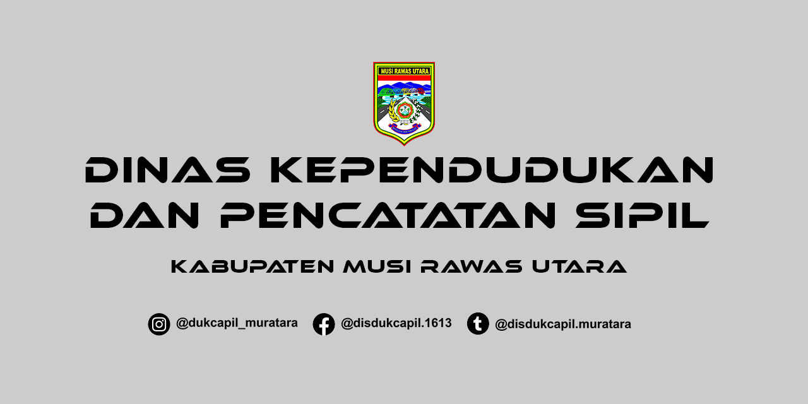

<div align="center">
**Layanan Informasi Kependudukan Terintegrasi**

##### `Sumber Data Semester I | Data Kependudukan Kabupaten Musi Rawas Utara`

---

[](https://github.com/dukcapilmru-tech/layanan-informasi/stargazers)
[](https://github.com/dukcapilmru-tech/layanan-informasi/blob/main/LICENSE)
[](https://github.com/dukcapilmru-tech/layanan-informasi/commits/main)
[](https://dukcapilmru-tech.github.io/layanan-informasi/)

---

</div>

## 📋 Daftar Isi

- [Tentang Kami](#-tentang-kami)
- [Visi & Misi](#-visi--misi)
- [Layanan Utama](#%EF%B8%8F-layanan-utama)
- [Data Kependudukan](#-data-kependudukan)
- [Cara Mengakses](#-cara-mengakses)
- [Kontribusi](#kontribusi)
- [Lisensi](#-lisensi)

---

## 🎯 Tentang Kami

**Dinas Kependudukan dan Pencatatan Sipil Kabupaten Musi Rawas Utara** adalah instansi pemerintah yang bertanggung jawab dalam pengelolaan administrasi kependudukan dan pencatatan sipil di wilayah Kabupaten Musi Rawas Utara.

Kami berkomitmen untuk memberikan layanan yang **cepat, akurat, transparan, dan mudah diakses** oleh seluruh masyarakat melalui platform digital ini.

> 💡 *"Mewujudkan pelayanan kependudukan yang prima demi kesejahteraan masyarakat"*

---

## 📊 Visi & Misi

### ✨ Visi

> Terwujudnya administrasi kependudukan yang akurat, tertib, dan terintegrasi untuk mendukung pembangunan daerah.

### 🎯 Misi

- ✅ Menyediakan layanan kependudukan yang profesional dan responsif
- ✅ Mengelola data kependudukan yang akurat dan terkini
- ✅ Meningkatkan aksesibilitas layanan melalui digitalisasi
- ✅ Mengoptimalkan pemanfaatan data kependudukan untuk perencanaan pembangunan

---

## 🛠️ Layanan Utama

### 1. 📝 Pendaftaran Penduduk

Layanan pendaftaran penduduk meliputi:

| Layanan | Keterangan |
|---------|------------|
| 🏠 Pendaftaran Baru | Pendaftaran penduduk baru di wilayah Musi Rawas Utara |
| 🚚 Perpindahan | Pendaftaran penduduk datang dan keluar wilayah |
| ✏️ Perubahan Data | Perubahan data pada dokumen kependudukan |
| 📄 Penerbitan Dokumen | Penerbitan dan perpanjangan dokumen kependudukan |

### 2. 📜 Pencatatan Sipil

Layanan pencatatan peristiwa penting dalam kehidupan:

- 👶 **Akta Kelahiran** — Pencatatan kelahiran bayi
- 💍 **Akta Perkawinan** — Pencatatan pernikahan resmi
- 💔 **Akta Perceraian** — Pencatatan perceraian
- ⚰️ **Akta Kematian** — Pencatatan kematian
- 👨‍👩‍👧 **Pengakuan Anak** — Pengakuan dan pengesahan anak

### 3. 📊 Pengelolaan Informasi Administrasi Kependudukan

Pengelolaan dan penyajian data kependudukan:

- 🗄️ Basis data kependudukan terintegrasi
- 📈 Rekapitulasi data kependudukan
- 📋 Pelaporan statistik kependudukan
- 🌐 Layanan informasi publik

---

## 📈 Data Kependudukan

Platform ini menyediakan akses informasi kependudukan yang meliputi:

| Kategori | Keterangan |
|:---:|---|
| 👥 **Jumlah Penduduk** | Data jumlah penduduk berdasarkan wilayah administratif |
| 📊 **Demografi** | Komposisi usia, jenis kelamin, pekerjaan, dan pendidikan |
| 📍 **Wilayah Administratif** | Data kecamatan, desa, dan kelurahan se-Kabupaten Musi Rawas Utara |
| 📑 **Statistik** | Laporan periodik kependudukan dan grafik perkembangan |

---

## 🚀 Cara Mengakses

### Untuk Pengguna Akhir

1. 🌐 Kunjungi website resmi: [dukcapilmru-tech.github.io/layanan-informasi](https://dukcapilmru-tech.github.io/layanan-informasi/)
2. 📋 Pilih menu layanan yang dibutuhkan
3. 📖 Ikuti petunjuk yang tersedia pada setiap layanan
4. ✍️ Isi formulir dengan data yang valid
5. 📤 Ajukan permohonan dan tunggu proses verifikasi

## Kontribusi

` @dukcapilmru-tech` `Tim IT Dukcapil MRU` 

## 📜 Lisensi
Proyek ini dilisensikan di bawah **Apache License 2.0** — lihat file **LICENSE** untuk detail lebih lanjut.

[](https://github.com/dukcapilmru-tech/layanan-informasi/blob/main/LICENSE)

### Untuk Pengembang

Clone repositori ini ke mesin lokal Anda:

```bash
git clone https://github.com/dukcapilmru-tech/layanan-informasi.git
cd layanan-informasi
